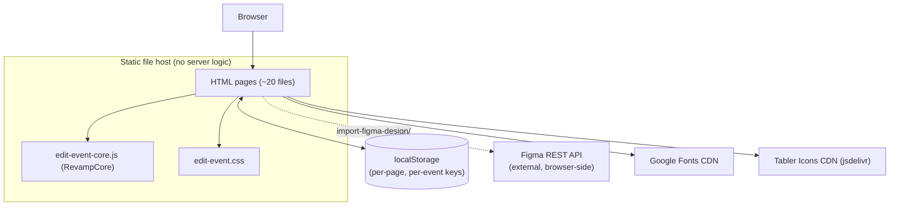
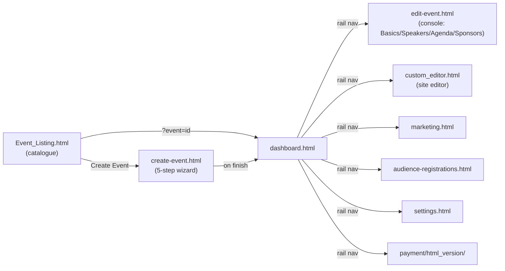
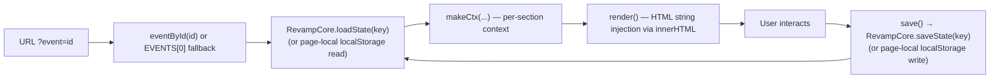

# Revamp CMS — System Architecture

_As of 2026-09-21. Companion to [PRD.md](PRD.md) (product scope) and [Design.md](Design.md) (data model, design tokens, component-level detail). This document covers the system's shape: layers, module boundaries, data flow, and integration points._

## Current architecture: client-only static prototype

There is no server tier. Every "page" is a standalone static HTML file served as-is; there is no build step, no bundler, no API, and no database. All application state lives in the browser (`localStorage`), scoped per page and per event id. This is a deliberate reading of the current repo, not a target state — see **Target architecture** below for the gap against the original build brief.

## Module boundaries

Three module families exist, each with its own state, styling, and page shell — they do not share a common layer today:

| Family | Pages | Shared module | Own `:root` palette |
| --- | --- | --- | --- |
| **Event console** | `dashboard.html`, `edit-event.html`, `edit-event-dashboard.html/js`, `edit-event-marketing.html/js`, `custom_editor.html`, `audience-registrations.html`, `marketing.html`, `settings.html` | `edit-event-core.js` (`RevampCore`) + `edit-event.css` | `edit-event.css` |
| **Event creation** | `create-event.html` | none (self-contained, ~4000 lines) | own `:root` |
| **Event catalogue** | `Event_Listing.html` | none | own `:root` |
| **Payments** | `payment/html_version/*` | own `data.js` / `index.js` / `sidebar.js` | own stylesheet |
| **Design import** | `import-figma-design/index.html` | none, calls Figma's API directly from the browser | own `:root` |
| **Auth shell** | `index.html` | none | own `:root` |

Only the "event console" family shares a common runtime (`RevampCore`) and stylesheet. Every other family is an isolated static bundle — see **Open Design Debt** in [Design.md](Design.md) for the resulting duplication.

## Navigation and data flow

Pages communicate through two channels only — there is no client-side router or app shell:

1. **Full page navigation** (`location.href` / `<a href>`), driven by `sidebar.js`'s `renderSidebar()` / `renderEventRail()`.
2. **The URL query string** (`?event=<id>`) carries the "current event" across page loads. Each page re-derives its own event object independently (`eventById(id)` or a local fallback to `EVENTS[0]`) — there is no shared session/context object.

Each arrow is a full page load carrying `?event=<id>` in the URL; none of it is enforced by a router, so a page reached without that param silently falls back to a default event.

### State/data flow within a page

There is no diffing or virtual DOM — `render()` regenerates HTML strings and reassigns `innerHTML`; state changes are persisted immediately (or on a debounce, in `create-event.html`'s case) straight to `localStorage`.

## The Create Event wizard as its own sub-architecture

`create-event.html` is architecturally a small SPA embedded in one file: a `STEPS` array, a state object `S` with `S.step`, and a `goStep(n)` transition function that shows/hides `<section id="step-N">` blocks and lazily renders the next step. It autosaves to `localStorage['revamp.createEvent.draft.v1']` on a ~520ms debounce, entirely independent of `RevampCore`. Full flow and state fields are documented in [Design.md](Design.md#create-event-wizard--state-machine-create-eventhtml).

The wizard does not own a preview surface. Its last step serialises the draft into editor-ready section markup, writes it to `localStorage['revamp.editor.handoff.v1']`, and navigates to `custom_editor.html?from=create`, which replaces its demo site with that payload. This is the one place two pages exchange more than an `?event=<id>` — a one-way, one-shot hand-off keyed by a URL param, with the storage key as the contract. Details in [Design.md](Design.md#editor-hand-off-create-event--custom-editor).

## External integration points

- **Figma REST API** — called directly from `import-figma-design/index.html` using a user-supplied file URL + personal access token; runs entirely client-side, no proxy/backend.
- **Google Fonts** — `<link>` per page (Fraunces, Manrope, IBM Plex Mono; Playfair/Lora/Poppins/Noticia in the editor).
- **Tabler Icons (jsdelivr CDN)** — used only by `payment/html_version/`.

No analytics, error-tracking, or telemetry integration exists in any page.

## Target architecture (per the build brief) vs. current state

The build brief (`Microsite_Builder_Flow (2).docx`) recommends a Next.js + Tailwind implementation; the current repo is plain static HTML/CSS/JS instead. The practical gap:

| Concern | Brief's intent | Current state |
| --- | --- | --- |
| Rendering | Next.js app (component-based, routable) | Static HTML files, no router, no components |
| State | Implied app/API-backed state | `localStorage` only, fragmented across 4 access patterns |
| Styling | Tailwind (single source of tokens) | 3 divergent hand-written `:root` token sets |
| Backend | Not specified, but publish/preview implies one | None — "Publish" is UI-only (toast message, no persistence beyond the browser) |
| Auth | "Roles, access, identity" described in copy | No auth logic anywhere |

This gap should be resolved deliberately (confirm whether the static build is the intended long-term stack or a throwaway prototype) before more pages are added on the current foundation — see **Risks & Open Questions** in [PRD.md](PRD.md).

## Deployment

No CI/CD, deployment config, or hosting reference is present in the repo (no `.github/workflows`, no `vercel.json`/`netlify.toml`, no `Dockerfile`). Pages are presumably opened/served as static files during development; there is no defined deployment pipeline yet.
